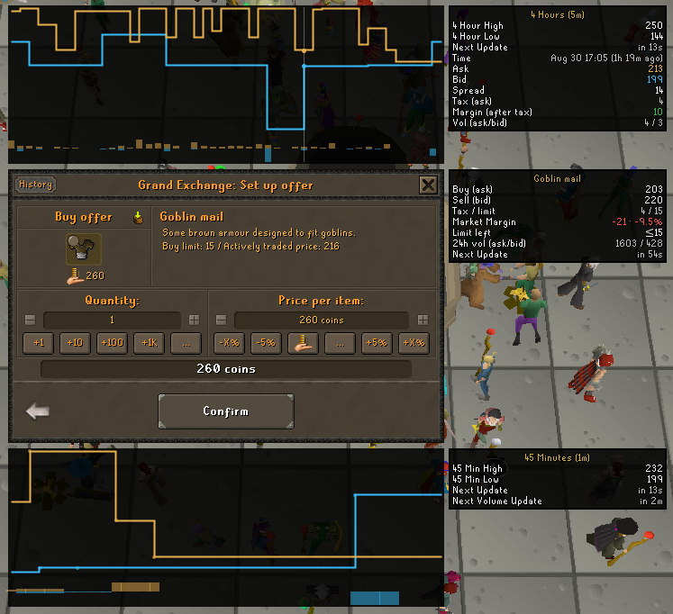
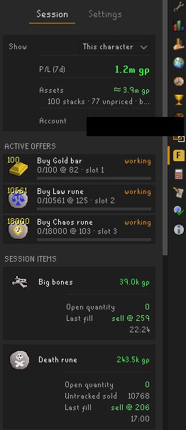
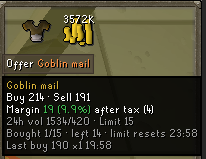

# Flip Goblin — RuneLite plugin

A Grand Exchange flip tracker for Old School RuneScape. It is informational only. The
plugin never places, changes, or collects offers for you.

**The plugin makes no network calls until you link an account.** Fill capture, session
profit and loss, buy limits, and asset snapshots all work locally in the client. Linking a
free [flipgoblin.com](https://flipgoblin.com) account is the one data switch. With a token
set, live market data becomes available, and your fills and assets sync to your own flipgoblin dashboard.
[COMPLIANCE.md](./COMPLIANCE.md) lists exactly what is sent. Removing the token stops all
of it.

When you put in a buy or sell order, price charts wrap the GE window and an info panel sits
to the right it. Hovering the top or bottom chart shows the exact time, ask, bid, spread, and after-tax margin at
that point. This is the most powerful differentiator when choosing your goto flipping plugin.

## Features

- **Market data at the GE.** Live ask and bid, the margin and ROI after tax, the buy
  limit, and 24-hour volume for the item you are trading.
- **Buy limits.** The item detail panel shows how much of the 4-hour limit you have used, how much is
  left, and when it resets.
- **Session tracking.** Every fill is captured as it happens. The side panel shows your
  profit and loss after tax, a card per item, and a log of your fills. This works with no
  account.
- **Offline fills.** Fills that land while you are logged out are picked up at your next
  login. They are marked "(offline)" with the time window they could have landed in.
- **Asset tracking.** Your bank, inventory, equipment, and GE holdings are combined into
  one sell-now value. With a [flipgoblin.com](https://flipgoblin.com) account, your dashboard keeps a history of your net worth.
- **Hover tooltips.** Hover any item in the GE to see its market data. An option extends
  this to your inventory.

  

 

## Build

RuneLite plugins target Java 11, so build with a JDK 11:

    JAVA_HOME=/path/to/jdk-11 ./gradlew build

`./gradlew run` starts the plugin inside a development RuneLite client. This needs an x64
machine with a display.

## License

BSD 2-Clause. See [LICENSE](./LICENSE). The no-automation policy and the full data
disclosure are in [COMPLIANCE.md](./COMPLIANCE.md).
